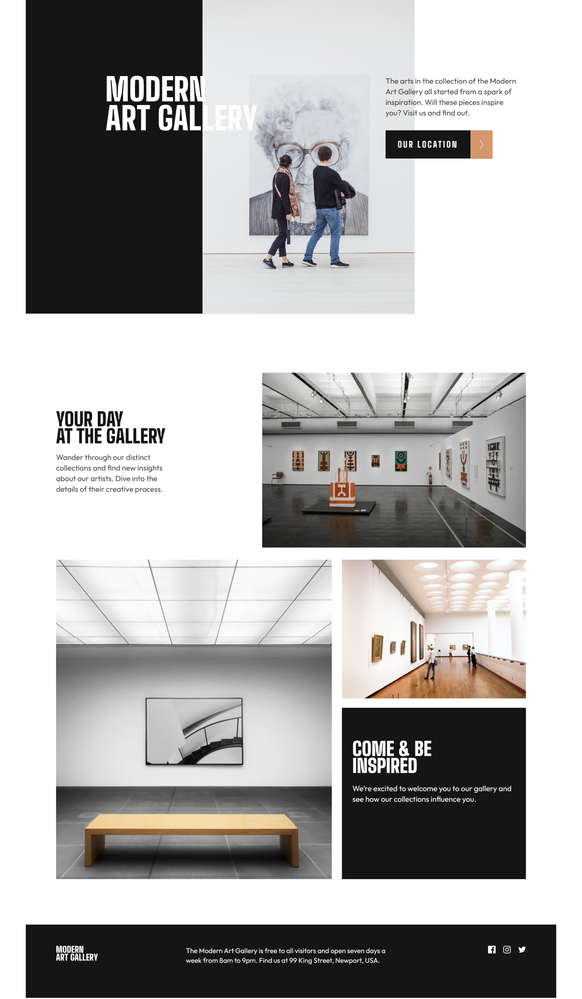
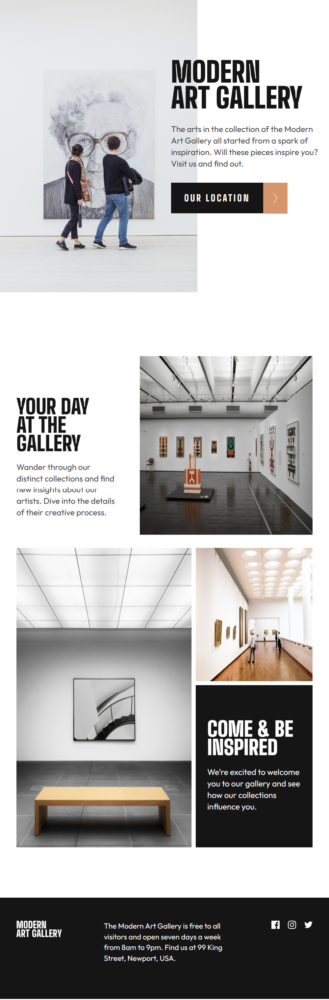
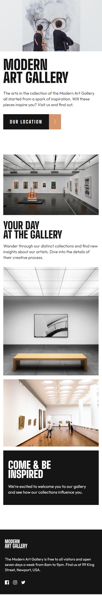

# Modern Art Gallery

Este proyecto es una **landing page moderna y responsiva** para una galería de arte ficticia llamada **Modern Art Gallery**. La página ofrece una experiencia visual clara y elegante que adapta su diseño según el dispositivo, gracias a una estrategia **Mobile First** y diseño **responsive**.





## 🌐 Demo en vivo

🔗 [Ver sitio desplegado](https://frankjimenez79.github.io/modern-art-gallery/)

---

## 🖥️ Tecnologías utilizadas

- **Vite** — Herramienta de desarrollo frontend rápida y moderna
- **Sass (SCSS)** — Preprocesador CSS para estilos más organizados y potentes
- **HTML5** — Estructura semántica clara
- **CSS3** — Estilos personalizados y media queries
- **Diseño Mobile First** — Optimizado primero para móviles
- **Responsive Web Design** — Adaptable a tablet y escritorio
- **GitHub Pages** — Despliegue gratuito del proyecto

---

## 📐 Enfoque de diseño

- ✅ Maquetado limpio y organizado por secciones
- ✅ Tipografía impactante y moderna con uso de mayúsculas
- ✅ Composición con imágenes de alta resolución y disposición en grid
- ✅ Contraste claro para facilitar la lectura
- ✅ Adaptación fluida con media queries

---

## 📁 Estructura del proyecto

```bash
modern-art-gallery/
├── public/              # Archivos estáticos
├── src/
│   ├── assets/          # Imágenes, íconos, etc.
│   ├── scss/            # Estilos en Sass organizados por carpetas
│   ├── main.scss        # Archivo principal de estilos
│   └── main.js          # Entrada de Vite
├── index.html           # HTML principal
├── vite.config.js       # Configuración de Vite
└── README.md            # Este archivo
```

---

## 🛠️ Cómo usar este proyecto

1. **Clona el repositorio**
```bash
git clone https://github.com/FrankJimenez79/modern-art-gallery.git
cd modern-art-gallery
```

2. **Instala las dependencias**
```bash
npm install
```

3. **Inicia el servidor de desarrollo**
```bash
npm run dev
```

4. **Genera la versión de producción**
```bash
npm run build
```

---

## 🚀 Despliegue con GitHub Pages

Este proyecto está desplegado automáticamente en GitHub Pages desde la carpeta `/dist` usando Vite.

---

## ✍️ Autor

- **Frank Jimenez**  
  [GitHub](https://github.com/FrankJimenez79)

---
